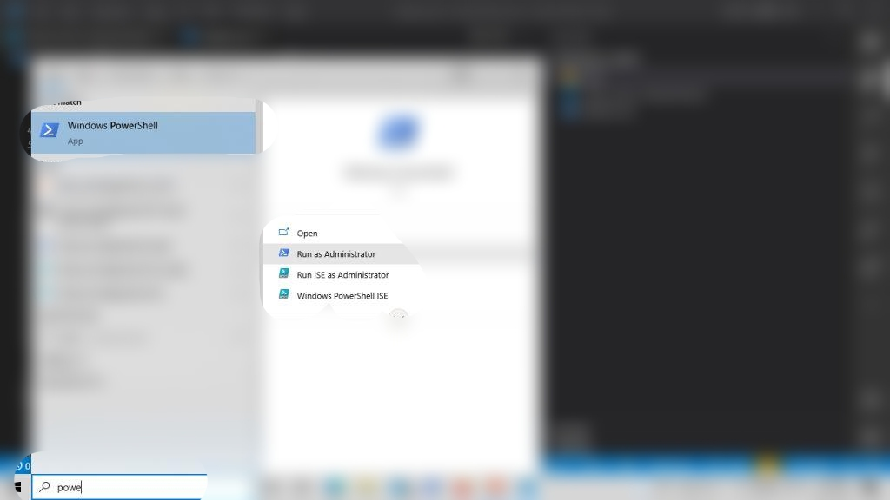

## Generate your React component

This repo is to show case the PowerShell script that I created to generate React component folder and also append the code structure that I commonly use. By doing this I was able mitigate the boredom that come while creating folder, file and writhing the snippet in side the file....😫😫😫.

### How can you use

1. Download the file "create_react_component.ps1"

The above process is fine to just create the component by using

Go to the same directory of the file

```
    create_react_component.ps1 <component_name>
```

2. In order to make the script run able we need to enable executing unsigned script in the system. Use the below command in PowerShell terminal in administrator mode.



```
    Set-Executionpolicy Unrestricted
```

3. To simplify the path while executing the script, we will use the PowerShell variable.

   1. Open PowerShell
   2. To edit the Microsoft.PowerShell_profile.ps1 , us the below command

      ```
          notepad.exe $PROFILE
      ```

   3. We need to add our variable in the file
     
      ```
      $CRC = "<full_path_of_the_script>"
      ```

If everything above is done correct you should be ble to create the component using the below syntax in Powershell terminal

```
& CRC <component_name>
```